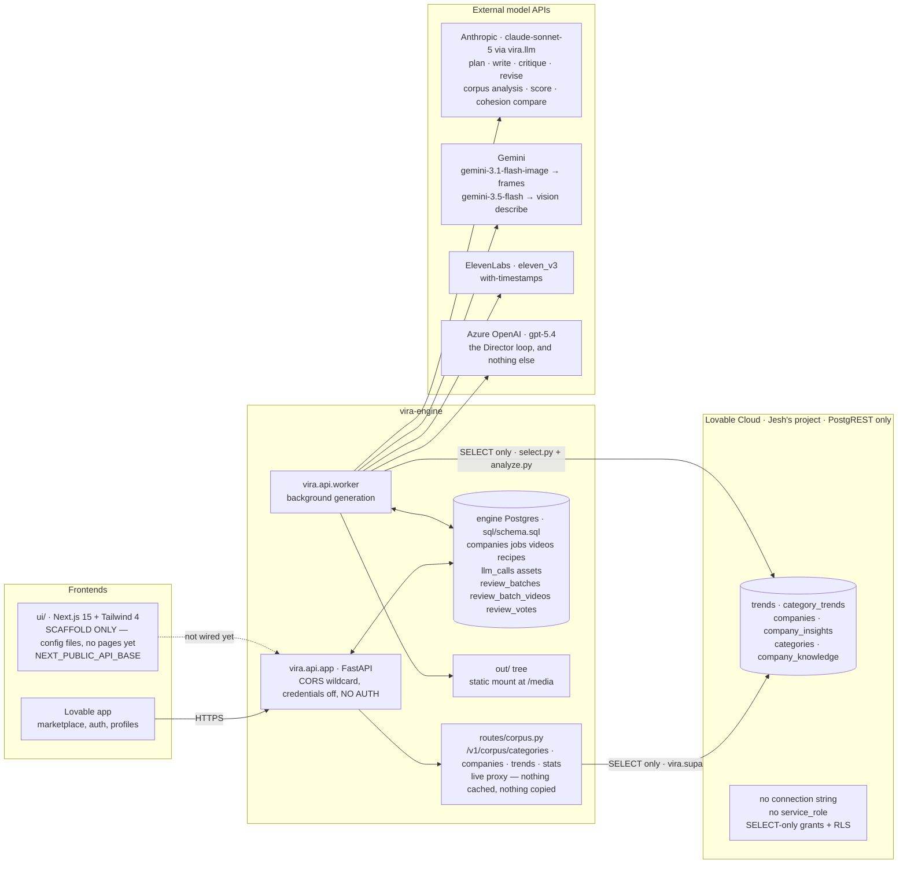
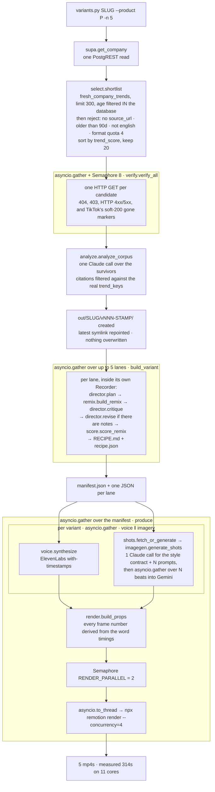
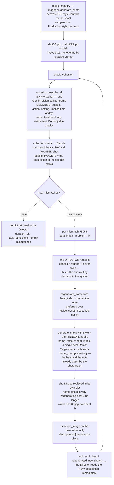
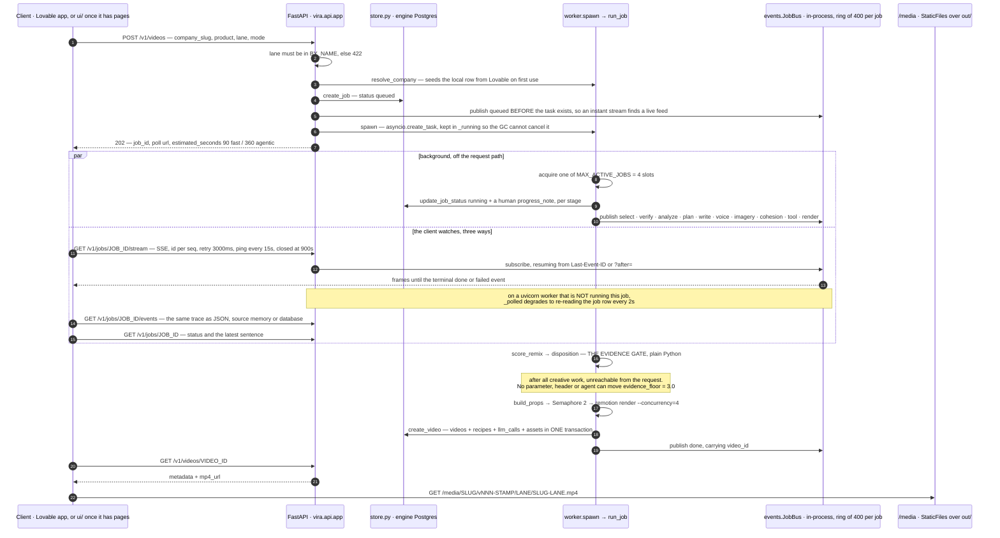
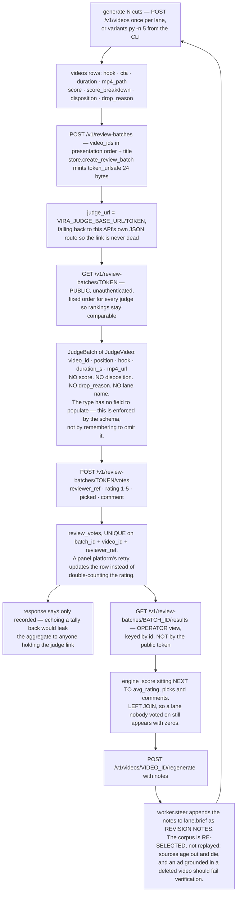
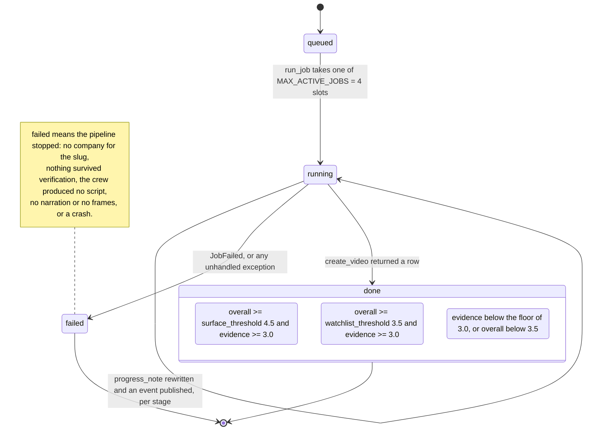

# Architecture, in diagrams

Eight diagrams of what the code actually does. Where a diagram and another doc
disagree, the diagram follows the code and says so — the discrepancies are
collected at the bottom.

Read [HANDOFF.md](./HANDOFF.md) first for why any of this exists. This document
answers *how*.

---

## 1. System context — who owns which data

**Question: there are three databases and four model vendors in play. Who owns
what, and where is the line nothing crosses?**



**What to notice.** Every arrow into Lovable Cloud is a read. There is no write
path in the generation flow at all — `vira.supa.Supa.insert` refuses without an
agent JWT, and the only caller that has one is `POST /v1/companies`, which
creates a company row and nothing else. `routes/corpus.py` is the interesting
addition: it exists precisely so a UI can browse the corpus without the engine
ever mirroring it. Verified live while writing this: 4,617 trends, 55% inside
the 90-day window that selection actually uses, 10 companies. Those numbers move
hourly, which is the whole argument in
[DATA-BOUNDARY.md](./DATA-BOUNDARY.md) for proxying rather than copying.

Also notice the model split. Four vendors, one job each: Claude writes and
judges text, Gemini makes and reads pictures, ElevenLabs owns the clock, and
gpt-5.4 only ever decides *what to do next* — it never produces an artefact.

---

## 2. The deterministic pipeline — what actually runs at the same time

**Question: `variants.py` makes five ads in 314 seconds, not 5 × 74. Where does
the concurrency come from, and what bounds it?**



**What to notice.** Only two things in this diagram are throttled, and for
different reasons. `verify_all` caps at 8 because TikTok rate-limits; the render
semaphore caps at 2 because Remotion is the only CPU-bound stage on the page and
five renders each grabbing four workers would thrash an 11-core laptop. The
network stages — image generation, the five lane scripts — are deliberately
unbounded.

The second thing: `score_remix` runs *inside* `build_variant`, before voice and
imagery. In this mode the evidence gate labels a variant that is then rendered
anyway. Disposition is metadata on the output, not a branch in the flow. The API
worker orders it the other way round — see diagram 6.

`render_remote.py` replaces only the `g3` render step: props and assets rsync to
chipdev, five renders run at once against 32 cores, mp4s come back. The Python
stages stay local because they are network-bound and more cores do not make an
HTTP round trip faster.

---

## 3. The agentic crew — the Director loop

**Question: what does the Director actually see, what can it call, and what
stops it running forever?**

```mermaid
sequenceDiagram
    autonumber
    participant E as agentic_video.py or worker._agentic
    participant D as Director · Azure gpt-5.4 · api_version 2024-10-21
    participant R as run_call fan-out · asyncio.gather
    participant P as Production state
    participant X as Claude · Gemini · ElevenLabs

    E->>P: Production with corpus already shortlisted and verified
    Note over E,P: RESEARCH is not a tool. select + verify + analyze run<br/>before the loop; the Director cannot redo or widen them.
    E->>D: system DIRECTOR_INSTRUCTIONS + brief with lane, look, voice, whitespace

    loop turn 1..MAX_TURNS = 10, aborted at WALL_CLOCK_BUDGET_S = 300
        alt 3 or fewer turns left, OR elapsed past 60% of the budget
            E->>D: BUDGET user message — turns and seconds left, stop polishing, reply DONE
        end
        D-->>R: one assistant turn carrying 1..n tool_calls
        Note over R: the fan-out. Every call in the turn is dispatched at once —<br/>running them in sequence was the single biggest slowdown.
        par concurrent tool calls from one turn
            R->>X: write_script or revise_script → Claude
        and
            R->>X: make_imagery → Gemini, N frames themselves in parallel
        and
            R->>X: perform_voice → ElevenLabs
        and
            R->>X: regenerate_frame beat i → Gemini, exactly one frame
        end
        R->>P: mutate remix · shots · mp3 · duration · descriptions · image_calls
        R-->>D: short strings only — counts, durations, verdicts, mismatch JSON<br/>each truncated at 6000 chars
        Note over D,P: the Director never receives an image, an audio file<br/>or a word timing. Descriptions and verdicts only.
    end

    D-->>E: an assistant turn with no tool_calls — the closing statement
    E->>E: score_remix + disposition, in Python, after the loop
```

The eight tools, and the specialist each one stands for:

| Tool | Specialist | Cost guard |
|---|---|---|
| `write_script` | NARRATIVE | — |
| `revise_script` | NARRATIVE | — |
| `assign_motion` | MOTION | validated in Python, adjacent repeats rewritten |
| `make_imagery` | IMAGERY | refuses if `image_calls + beats > MAX_IMAGE_CALLS = 24` |
| `regenerate_frame` | IMAGERY | refuses at the same ceiling, costs 1 |
| `perform_voice` | VOICE | — |
| `check_cohesion` | COHESION | — |
| `critique_film` | CRITIC | — |

**What to notice.** The caps live outside the conversation. `MAX_TURNS = 10`,
`WALL_CLOCK_BUDGET_S = 300`, `MAX_IMAGE_CALLS = 24` are module constants the
Director cannot read, argue with, or raise — but the budget *nudge* deliberately
tells it what is left, because a Director that cannot see its budget polishes
until something stops it. A real run converged in 7 turns and 250 seconds.

The fan-out is what made that possible. The model routinely emits three
`regenerate_frame` calls in one turn, or imagery and voice together; those are
independent network calls and now overlap. A tool that raises does not kill the
loop — the exception comes back as `ERROR: ...` in the tool result, which is
information the Director can act on.

`RESEARCH` in [AGENTIC-VIDEO-SYSTEM.md](./AGENTIC-VIDEO-SYSTEM.md) has no tool.
Grounding is not delegated, by design.

---

## 4. The COHESION loop — the only stage that looks at what came back

**Question: everything upstream works on intent. Who checks what was actually
produced?**



**What to notice.** Three details carry this loop, and each of them is a scar.

The style contract is **pinned**, not re-derived. When each fix invented a fresh
look, the corrected frame stopped matching its neighbours and the loop chased
its own tail for six turns.

The regeneration is **surgical**. One beat, one Gemini call, written back into
its own numbered slot, and only that one description refreshed. Nothing else in
the film is touched.

And the re-check is **free of a round trip** — `regenerate_frame` returns the
new vision description inline, so the Director can see whether its correction
landed without spending a turn on `check_cohesion`. A full re-check is still
available and still costs N vision calls in parallel.

`cohesion.check` failing is not fatal: it returns a neutral verdict with the
error in it. A broken continuity check must not stop a film that is otherwise
fine.

---

## 5. Timing — the synthesiser is the master clock

**Question: where do frame numbers come from, and why does nothing hand-author
one?**

```mermaid
flowchart TD
    A["remix.beats — say lines, plus draft t values<br/>that are about to be discarded"] --> B["voice.direct<br/>prepends a performance tag per SPOKEN beat:<br/>lane.opening, then lane.middle rotating, then lane.closing.<br/>Position counted over beats with a non-empty say —<br/>a blank first beat must not steal the opening tag."]
    B --> C["POST ElevenLabs /v1/text-to-speech/VOICE_ID/with-timestamps<br/>model eleven_v3 · stability 0.0, a creativity dial not a consistency one"]
    C --> D["response carries audio_base64 AND<br/>alignment.characters<br/>character_start_times_seconds<br/>character_end_times_seconds"]
    D --> E["_words_from_alignment<br/>walks the API's OWN character array and skips every<br/>bracketed span, because a performance tag occupies<br/>characters in the alignment but is never spoken"]
    E --> F["list of Word — w, start, end, in seconds"]
    F --> G["_assign hands the words back to the beats BY POSITION,<br/>n = word count of beat.say.<br/>Never by string match: the synthesiser normalises<br/>punctuation, so one apostrophe would shift every word after it."]
    G --> H["beat.start_s · beat.end_s · beat.words · beat.t overwritten"]
    H --> I["render.build_props · fps = 30<br/>startFrame = start_s × fps<br/>endFrame = end_s × fps<br/>word.startFrame = w.start × fps<br/>durationInFrames = duration_s + 2.4 outro, × fps"]
    I --> J["props.json — the entire seam between Python and Remotion"]
    J --> K["AdVideo.tsx<br/>Sequence from=startFrame, duration = end − start<br/>useSpoken compares the current frame to word.startFrame<br/>for the karaoke highlight.<br/>Remotion performs NO timing arithmetic of its own."]
```



**What to notice.** Only one component in the whole system converts seconds to
frames, and it is `build_props`. Everything downstream reads integers it was
handed. That is what makes a copy edit re-time the entire video for free, and it
is why localisation later costs a translation pass and nothing else.

The tag-skipping in `_words_from_alignment` is not a nicety. `[excited]` is nine
characters in the returned alignment and zero milliseconds of speech; matching
our own source text against that array would shift every subsequent word by the
cumulative length of the tags, and the captions would drift further out of sync
the longer the ad ran.

`duration_s + 2.4` is the outro card. The composition fades it in over the last
2.4 seconds and the audio has already finished by then.

---

## 6. The API request lifecycle

**Question: a generation takes 74–350 seconds. What does a request actually get
back, and where does the evidence gate sit relative to it?**



Alongside the generation endpoints, `routes/corpus.py` serves four read-only
views straight off Lovable — `/v1/corpus/categories`, `/companies`, `/trends`,
`/stats` — with no caching layer between them and PostgREST. `/v1/companies` is
a different thing and answers a different question: it lists the engine's own
table, the companies it has generated for.

**What to notice.** The gate sits between the creative work and the database
write, on a code path no HTTP request can reach. There is no `?skip_score=`,
because there is nowhere to put one. The same is true of timings: no endpoint
accepts a frame number.

The event bus is in-process on purpose — progress is conversation, and the
durable account of a run is the recipe, written atomically with the video. The
cost of that choice is stated in the code and handled rather than hidden: on the
wrong uvicorn worker the SSE stream falls back to polling the job row, and says
so in a comment frame the client can see.

`ui/` is currently a Next.js 15 scaffold — `package.json`, `tsconfig`,
`next.config.ts`, Tailwind 4 and an `.env.local.example` pointing at
`http://127.0.0.1:8720`. No pages, no fetches. Mark it as in progress.

---

## 7. The human review loop

**Question: how does a human ranking get collected without the engine's own
opinion contaminating it?**



**What to notice.** Two separations do the work here. The judge payload is its
own Pydantic type rather than the video row with fields hidden, so a future
refactor cannot leak a score into it by spreading a dict. And results are keyed
by batch id while the judge view is keyed by the public token — holding the
judge link gets you the films, never the running tally.

Regeneration re-runs the lane rather than patching the script, because a rewrite
of a weak script tends to keep the weak structure. The lineage back to the
previous video lives in the recipe jsonb, not in a column: `jobs` has no
`source_video_id`, which HANDOFF already lists as open.

---

## 8. A job's states

**Question: what are the terminal states, and is a dropped ad a failure?**



**What to notice.** `dropped` lives inside `done`. A cut the evidence gate
rejected was still generated, still rendered, still stored with its full recipe,
and is still served from `/media`. "What the engine rejected and why" is a
first-class output — `disposition` and `drop_reason` are columns precisely so
the rejection is queryable rather than absent. Everything generated so far has
been dropped on evidence, and
[CONTEXT-RETRIEVAL.md](./CONTEXT-RETRIEVAL.md) argues that is a retrieval
problem, not a scoring problem.

`started_at` is stamped once via `COALESCE` and never reset by a later progress
write; `finished_at` is stamped on both terminal transitions.

---

## Where the code and the docs disagree

Each of these is a place a reader would be misled by an existing document. The
code is the source of truth in every row.

| Claim | Where | What the code does |
|---|---|---|
| MOTION assigns the caption treatment | AGENTIC-VIDEO-SYSTEM.md, `remix.py` prompt, `assign_motion` tool | **`AdVideo.tsx` ignores it.** The treatment is `TREATMENTS[index % 5]` and the camera move is `i % 4`. `build_props` emits `motion` and `camera`, but `BeatProps` does not declare them and nothing reads them. The spec names replacing `i % 5` as MOTION's whole purpose; that has not happened. Every per-beat motion decision — by the writer or by the Director — is currently inert. |
| Seven specialists, TypeScript `@openai/agents`, `skills/` directory | AGENTIC-VIDEO-SYSTEM.md | Python loop against `AsyncAzureOpenAI`, 8 tools covering 6 specialist domains. RESEARCH is not a tool — retrieval runs deterministically before the loop. **`skills/` is NOT BUILT.** `maxTurns` is 10, not the 8 in the migration plan. |
| "Every tool call lands in the recipe, so RECIPE.md becomes a full transcript" | AGENTIC-VIDEO-SYSTEM.md | Only calls routed through `vira.llm` are captured verbatim. The Director's own Azure conversation — its reasoning, its tool arguments, the budget nudges — goes to `AsyncAzureOpenAI` directly and is never seen by `provenance.Recorder`. The recipe gets `crew_log` summary lines, `director_closing` and `image_calls`. |
| `assets.description` holds what a vision model says the frame actually shows | DATA-BOUNDARY.md, API.md, schema comment | **Always NULL.** Cohesion descriptions live in `Production.descriptions` and are never merged into the shot dicts, so `store.create_video` inserts `shot.get("description")` from a key nothing writes. The intent-vs-reality column has no reality half. |
| Retrieval calls `recommend_company_trends` with an explicit query embedding | DATA-BOUNDARY.md §5 | `select.shortlist` uses `fresh_company_trends`, a category join with a server-side date filter. No embedding is generated anywhere in the codebase. HANDOFF acknowledges this as the live problem; DATA-BOUNDARY reads as though it is already done. |
| Python owns `trend_enrichment` and `render_runs` | DATA-BOUNDARY.md §3 | Neither table exists. `sql/schema.sql` has companies, jobs, videos, recipes, llm_calls, assets and the three review tables. |
| `videos.mp4_path` "stays NULL for a video that was scored and dropped before rendering" | schema.sql comment | No such path exists. `_produce` renders before `create_video` unconditionally, so a dropped video always has an mp4. |
| `jobs.lane` is "NULL when the job fans out across all lanes" | schema.sql comment | There is no fan-out endpoint. `POST /v1/videos` requires exactly one lane and rejects anything not in `BY_NAME`. |
| The endpoint list | API.md | Missing three things now on disk: `GET /v1/jobs/{id}/stream` (SSE), `GET /v1/jobs/{id}/events`, and the four `/v1/corpus/*` proxies. |
| "select → verify → analyze → plan → write → critique → revise → score → voice ‖ imagery → render" | HANDOFF.md | True for the API worker and the agentic path. **Not true for `variants.py`**, where `score_remix` runs inside `build_variant`, before voice and imagery. Same gate, different position in the sequence. |

One code-level bug worth recording while it is visible: in
`crew.run_call`, `return call.id, str(await fn(p, args)) if fn else (call.id, ...)`
binds the conditional to the second element, so an unknown tool name produces a
nested tuple rather than the intended error string. Unreachable while the model
only emits declared tool names, and harmless if it happens — the value is
stringified into the tool result — but it is not what the line looks like it
says.
